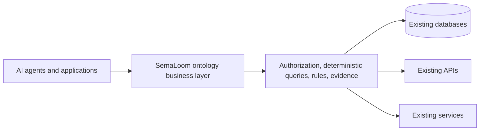

# SemaLoom

[English](README.md) | [简体中文](README.zh-CN.md)

[](https://github.com/levi-qiao/SemaLoom/actions/workflows/ci.yml)
[](LICENSE)
[](pyproject.toml)

**An ontology-driven business layer for serious AI questions over existing enterprise data.**

SemaLoom compiles business objects, metrics, rules, policies, and controlled actions into immutable
semantic releases. Domain packs own business meaning. Independent integration bindings and adapters
own tables, APIs, credentials, and vendor details. The runtime composes bounded cross-source reads
inside one Python application process. Existing databases, APIs, and services remain the systems of
record: SemaLoom maps them into a governed business vocabulary without requiring schema changes,
data migration, or a replacement data platform.

The repository is a **pre-alpha synthetic proof of concept**. Tax and procurement are examples used
to test reuse; neither domain is built into the core.




## What works

- Deterministic compilation of two synthetic domain packs.
- PostgreSQL metric and object reads with tenant filters and typed evidence.
- In-process links across databases using complete declared business identities, including composite keys.
- Typed, exact-decimal rules with distinct TRUE, FALSE, UNKNOWN, and operational failure outcomes.
- An [embedded Python SDK](docs/python-sdk.md) for compilation, discovery, point queries,
  collection analysis and claims, using the same runtime without starting a web server.
- Immutable semantic candidate validation, independent approval and release activation, plus a
  plan/approve/execute prototype that writes an in-process draft store.
- Read-only OpenAPI mappings and disjoint PostgreSQL/API properties for the same entity, composed
  inside the Python process.
- FastAPI endpoints and an embedded Studio for graph/inspection, Metric editing, structured
  versioned drafts, mapping/source administration, physical source trace, and review/publish
  history on synthetic data.
- Ontology-guided Chat that asks for missing business scope through typed cards before querying,
  selects tables/charts only when they help the result, and keeps provenance collapsed by default.
- Chinese and English application copy, with each answer following the language of the current
  user message. Universal agent instructions and tool descriptions remain in English.

## Serious business questions

SemaLoom is designed for questions where a fluent answer is insufficient. The server pins an
approved ontology release and authenticated tenant/actor context, asks for missing business scope,
uses exact decimal arithmetic, distinguishes missing observations from false claims and failures,
and returns inspectable evidence with each factual result. This makes the architecture suitable for
financial review, tax, procurement, compliance, and other governed workflows while the included
examples remain synthetic.

Presentation is derived at runtime from semantic result shape. A concise answer may need no chart;
comparisons, time series, tabular records, and relationships can use different components without
embedding industry-specific branches in the universal core.

## Optional Jev decision hook

The optional TypeSafe Jev integration receives the current question, locale, a bounded redacted
conversation summary, the authorized ontology catalog, and live generic tool schemas. It may suggest
the next tool and arguments. The server still validates typed inputs, authorization, query execution,
and evidence, so Jev is never treated as a source of business facts or permissions. Shadow mode is
the default and deterministic routing remains available when the provider is absent or fails.

Not in this tree: production identity (local demo tokens only; other profiles refuse to start),
MCP SDK transport (`GET /v0.1/mcp/tools` is a static name list), composite-key cross-source collection
analysis, enterprise Action recovery, a finished structured
Rule editor, and the joint Studio gate. See [capabilities and limits](docs/capabilities.md).

For the implemented read-only business-analysis flow, HTTP tool schemas and AI host instructions,
see [AI analysis](docs/ai-analysis.md).

## Quickstart

Requires Python 3.13, [uv](https://docs.astral.sh/uv/), and PostgreSQL 16 on loopback. Docker
Compose **or** Homebrew `postgresql@16` with role `semaloom` are equivalent isolated fixtures.
The deterministic SDK and Studio do not require a model key. Use only the checked-in synthetic
fixtures for the public quickstart.

```bash
uv sync --frozen
docker compose up -d --wait   # skip when Homebrew PostgreSQL already has the four synthetic DBs
uv run semaloom load-fixtures
uv run semaloom compile examples/tax examples/procurement
uv run semaloom query \
  --metric tax.reportedIncome \
  --binding taxpayerId=TAXPAYER-A \
  --binding taxYear=2024 \
  --binding perspective=TAX_RETURN \
  --period-from 2024-01-01 \
  --period-to 2025-01-01
uv run semaloom serve --host 127.0.0.1 --port 8000
```

Open `http://127.0.0.1:8000/studio/?view=objects&entity=tax.Taxpayer`. Expected query value is the
synthetic decimal `110.1000`. Demo bearer `tenant-a-analyst` is local-dev only. Five example
classes (Query, Evidence, policy period switch, missing/UNKNOWN, draft Action) are in the
[quickstart](docs/quickstart.md).

## Architecture and contribution

- [Architecture](docs/architecture.md) — stable boundaries and decisions.
- [Semantic contract](docs/spec/semantic-contract-v0.1.md) — observable semantics and diagnostics.
- [Studio design](docs/DESIGN.md) — information architecture, interaction, and visual system.
- [Plan](docs/PLAN.md) — implemented slices and remaining gates.
- [Contributing](CONTRIBUTING.md) — development workflow and checks.
- [Security](SECURITY.md) — trust boundaries and private reporting.

Apache-2.0 licensed. See [LICENSE](LICENSE), [third-party notices](THIRD_PARTY_NOTICES.md),
[Code of Conduct](CODE_OF_CONDUCT.md), and [Support](SUPPORT.md).

Optional Studio Chat, Pi harness setup, and provider configuration are documented in
[Chat Harness](docs/chat-harness.md). Never commit a provider key. Security boundaries are in
[Security](SECURITY.md), with design notes in [Jev integration research](docs/research-jev.md).

Collection analysis, human-readable evidence, and end-to-end acceptance are tracked in
[analysis quality](docs/analysis-quality.md).
