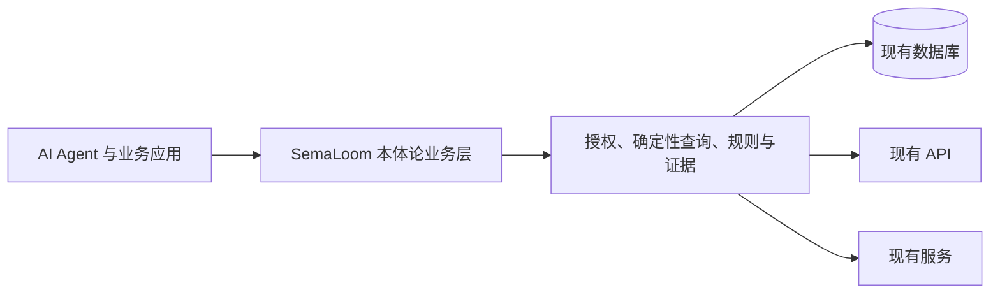

# SemaLoom

[English](README.md) | [简体中文](README.zh-CN.md)

**SemaLoom 是面向严肃业务问答的本体论驱动业务层。**

它把业务对象、属性、指标、关系、规则、政策和受控操作编译为不可变语义版本；领域 YAML 负责业务含义，独立接入层负责数据库、API、凭证和厂商协议。现有数据库、API 与服务继续作为事实来源，SemaLoom 通过 Mapping 和 Adapter 建立受治理的业务语义，不要求修改源端表结构、迁移数据或替换既有数据平台。

项目目前是 **pre-alpha 合成数据原型**。税务、采购和财务示例用于验证核心的跨领域复用，并未写入通用引擎。



## 当前能力

- Python 编译器、运行时和嵌入式 SDK，共用同一套授权、精确十进制与证据语义。
- PostgreSQL 与只读 OpenAPI 接入，以及基于声明关系的有界跨源读取。
- TRUE、FALSE、UNKNOWN 与运行故障相互区分的确定性规则执行。
- Studio 图谱、实体、Mapping、数据源、API 契约、草稿和发布管理。
- 本体驱动问答：范围不足时先展示补充卡片，范围明确后再查询；表格、柱状图、趋势图与关系图按结果结构选择，没有必要时只用文字。
- 导航、问答、补充卡、结果与证据支持中文和英文；问答优先跟随当前用户消息的语言，通用 Agent 提示词和工具说明统一使用英文。部分既有 Studio 管理表单仍以中文为主。
- 可选的 TypeSafe Jev 决策 hook，根据当前问题、有界上下文、本体目录和实时工具 Schema 选择下一步；服务端仍负责参数校验、授权、查询和证据。

## 严肃业务问答

SemaLoom 面向不能只依赖流畅文本的业务场景。每次请求固定已批准的本体版本及认证后的租户、主体上下文；业务范围不足时先通过卡片补充条件，再执行确定性查询。金额采用精确十进制，并严格区分“缺少观测”“结论为假”和“运行故障”。事实结果附带可检查证据，适用于财务复核、税务、采购、合规等受治理流程；仓库中的数据仍全部是合成示例。

展示组件由语义结果的结构在运行时选择：简单结论无需强行配图，对比、趋势、明细与关系数据可分别使用更合适的组件。通用核心不包含财务、税务或其他行业的硬编码判断。

## 快速开始

需要 Python 3.13、[uv](https://docs.astral.sh/uv/) 和本机 PostgreSQL 16。公开演示只使用仓库内合成数据，不需要模型密钥。

```bash
uv sync --frozen
docker compose up -d --wait
uv run semaloom load-fixtures
uv run semaloom compile examples/tax examples/procurement
uv run semaloom serve --host 127.0.0.1 --port 8000
```

打开 `http://127.0.0.1:8000/studio/`。CLI 查询、五类可运行示例和 Homebrew PostgreSQL 配置见 [quickstart](docs/quickstart.md)。

## 可选问答与 Jev

Studio Chat 的模型连接、Pi harness 安装和环境变量见 [Chat Harness](docs/chat-harness.md)。Jev 只接收当前问题、locale、脱敏且有界的会话摘要、已授权本体目录和通用工具 Schema；不会接收原始查询结果、数据库凭证、物理 Mapping 或业务身份值。它只建议下一步工具与参数，不能提供业务事实、授权、执行查询或生成证据。默认 shadow 模式；外部 provider 缺失或故障时保留确定性路径。密钥只通过环境变量提供，不能提交到仓库。

## 项目文档

- [能力与限制](docs/capabilities.md)
- [架构](docs/architecture.md)
- [语义契约](docs/spec/semantic-contract-v0.1.md)
- [Studio 设计](docs/DESIGN.md)
- [贡献指南](CONTRIBUTING.md)
- [安全与私密报告](SECURITY.md)
- [第三方许可](THIRD_PARTY_NOTICES.md)

SemaLoom 使用 [Apache-2.0](LICENSE) 许可。普通问题见 [Support](SUPPORT.md)，社区行为规范见 [Code of Conduct](CODE_OF_CONDUCT.md)。
