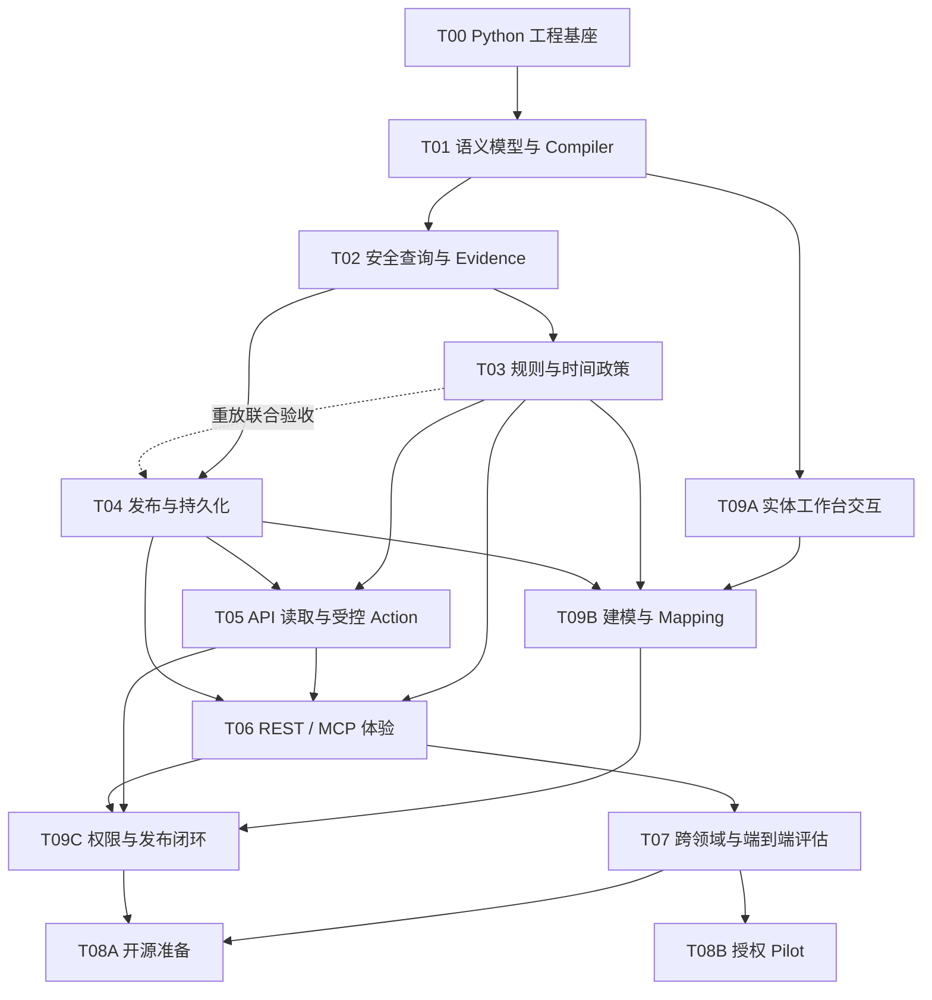

# SemaLoom 执行计划 v0.1 — Python

## 1. 目标与当前状态

SemaLoom 是 **Python 编写、采用 Apache-2.0、领域与协议中立的通用企业业务语义层**。企业以领域包维护业务定义，以独立接入绑定与 adapter 对接系统，Agent 通过语义标识使用它们，事实以业务系统为准。首版通过 PostgreSQL 和受控 OpenAPI 完成查询、判断及草稿操作闭环。

当前实现覆盖编译、PostgreSQL 点查、有限跨库 Link、规则、发布注册表、Action 与 Studio 的合成纵向切片。完整状态见第 8 节；未通过后续 gate 的原型不标记为完成。各任务的完成条件以 [验收矩阵](acceptance.md) 为准。

## 2. 交付原则

- 按可验证的纵向结果推进，保持一个 Python 应用进程；接入、跨库组合与恢复任务内置，统一启动。
- 核心拥有语义与执行规则；基础设施通过小接口复用。
- 第一条查询同时验证权限拒绝路径与证据。
- 最小采购案例随 T01–T03 验证模型和读取规则，T07 完成跨领域操作回归。
- 开源准备与真实 pilot 分开验收；工期依据已完成 gate 的实测工作量估算。

职责与技术选择见 [architecture](architecture.md)。

## 3. 已定、待细化、待维护者决定

| 状态 | 内容 |
| --- | --- |
| 已定 | Python 主体、Apache-2.0、模块化单体、事实留源、领域包与独立接入层、不可变 release、参数化查询、三值 Claim、Decimal、默认拒绝、受控 Action |
| 已定 | SQLAlchemy Core + PostgreSQL、不同连接配置的进程内受限跨库组合、受限表达式 IR、固定授权 profile |
| 执行 agent 细化 | Python 受支持次版本、依赖 pin、Pydantic 类型、DSL Schema、函数签名、SQLAlchemy sync/async 策略、错误格式、数据库迁移、测试工具和具体预算 |
| 真实 pilot 前确认 | 数据与接口访问授权、脱敏数据范围、政策专家、审批角色、部署方式、保留策略、负载/SLO 和恢复要求 |
| 开源发布前确认 | 实际版权署名、包/仓库 namespace、漏洞报告渠道 |

后两行不阻塞本地合成数据实现。不得用 demo 身份或演示政策冒充生产就绪。公共契约之外的能力需单独确定范围、兼容性和验收。

## 4. 首版范围与成功标准

两个合成领域从 T01 起共同验证核心。税务 fixture：一个合成企业、2024/2025 两个期间、申报/审计两种口径、2–3 个 ObjectType、支撑规则所需的少量 Metric 词条（指向已映射测量槽，不按科目复制 Mapping）、3–4 条 Rule、一个 `CreateTaxAdjustmentDraft` Action。词条只覆盖业务语言，不穷举来源公式。

规则至少涵盖：跨口径对账、带舍入的金额公式、政策时间边界、缺失输入 UNKNOWN。税务参数均为演示，真实法规配置需要另行专家审核。

采购 fixture 使用订单、组织、金额/数量及审批政策，以少量对象和指标，验证同一个 Runtime 能查询、判断和（通过同一 OpenAPI profile）创建草稿；核心中不增加 `if domain == tax` 或采购专用代码。

首版接口限于精确查询、有限关系、受限规则及单笔审批操作。业务请求不接受任意 SQL、URL、上传代码或自行声明的权限；新增 Mapping 必须经验证与审核激活。

最重要的产品验收不是回答流畅，而是：

- 已支持协议内新增 Metric/Mapping/Rule/Policy，只增加领域定义、接入绑定与测试，不新增 Runtime 分支、Controller 或 MCP Tool。
- 相同业务输入、release、执行/环境 profile、权限范围和来源版本产生相同语义计划/结果；每个 Claim 的证据可追溯，错误不会伪装为确定事实。
- 数据与操作权限不可被请求、语义路径、搜索、缓存、证据和派生值绕过。
- 审批绑定具体操作，重试和进程故障不会被当作重新写入的理由。
- 税务与采购复用相同 core，新增协议特殊性则明确承认需要 adapter 工作。

## 5. 任务地图

T03 与 T04 可以在 T02 的模型接口稳定后并行开发，T04 的历史重放最终验收需要 T03 的真实执行器；T06 的当前版本只读接口可在 T03 后开始；历史版本与持久化解释依赖 T04，写操作依赖 T05。T08A/T08B 是 T08 的独立 gate，可以分别完成。每个任务的公开接口、共享模型和规范修改由一个明确任务 owner 统筹，避免多个 agent 同时重写 core model。图不授权 agent 自行发布或接入真实系统。

## 6. 大块执行任务

### T00 — Python 工程与可重复验证

**目标**：一个能在干净环境重建、检查和运行最小入口的 Python 项目。

**输入**：[AGENTS.md](../AGENTS.md)、[architecture](architecture.md)、[CONTRIBUTING.md](../CONTRIBUTING.md)。无前置实现任务。

**工作与产物**：建立 `pyproject.toml`、`uv.lock`、`.python-version`、`src/semaloom/`、测试和 CI；固定经过验证的依赖版本，建立 core/import 方向检查、runtime build 身份及 Apache-2.0 发行物声明。只建立当前入口所需代码，不按目录图批量创建空接口。提供本地 PostgreSQL fixture 的可重复启动方式，工具与输出保持项目内或任务临时目录。

**局部设计由 agent 完成**：支持的 Python 次版本、测试/类型检查工具、配置加载、sync/async 组合和 CI 命令。核心计算不能依赖 FastAPI 请求生命周期；阻塞调用不能直接堵住异步事件循环。

**Gate**：干净 `.venv` 可按锁文件重建；真实命令能运行格式、类型和最小测试；依赖检查能拒绝 core/公共 Compiler 导入 adapter 或领域实现的违反案例。无真实系统凭证也可启动本地开发 profile；验证 wheel/sdist 可构建、包含 LICENSE 且可安装，并为后续示例建立 README 命令入口，完成 A49 的 T00 阶段发行物检查和 A62 的 T00 阶段单入口检查。

**不包含**：业务规则、完整 DSL、线上部署。交给 T01 一个可验证的工程，而非空目录列表。

### T01 — 语义类型、领域包与 Compiler

**目标**：可以严格描述首个场景，并编译成 Runtime 可消费的不可变 bundle。

**输入**：T00；[CONTEXT](../CONTEXT.md)、[semantic contract](spec/semantic-contract-v0.1.md)。

**工作与产物**：按 [ADR-0006](adr/0006-independent-integration-layer.md) 分离领域定义与接入绑定；统一类型与 ID/引用规则；ObjectType、Metric、Link、Mapping、Rule、Policy、Action、授权 profile 的最小定义；对象属性/指标 Query、Observation、Claim 定义与评估结果、Evidence 类型；Schema 正反例；safe YAML 解析；引用/类型/依赖检查；bundle digest 和 IR 兼容声明。创建合成税务领域包和期望结果，并编译最小采购包，验证同一模型支持非财税身份和适用范围。定义跨来源 Link 的业务键类型、目标基数和能力约束；明确包 ID/version、精确依赖、冲突拒绝及支持的契约版本；本地文件组合即可。

**局部设计由 agent 完成**：Pydantic 与内部类型的合理分工、Schema 生成路径、诊断定位格式、IR 序列化和兼容策略。Rule 仅定义有限运算节点；不得把业务 Python 源代码装入 bundle。Action 字段先以生命周期需求定义，T05 可在保持不变量时迭代。

**Gate**：通过 A01–A04，完成 A05、A44、A51、A53、A60、A61 的 T01 阶段；同内容编译结果稳定；非法引用、类型/单位、重复 ID、政策重叠和 Rule 环拒绝；离线 compile 与联机来源验证状态有明确区分。Schema 与完整正反例可自动校验。真实来源 drift 和可信激活分别在 T02/T04 验收，不要求 T01 提前实现它们。

**不包含**：UI、Registry 管理后台。可用本地 bundle loader，但不能假称已实现可信生产发布。

### T02 — 首条安全查询、Planner 与 Evidence

**目标**：通过 approved Mapping 读取 PostgreSQL，在同一进程内组合两个库的业务观测，返回有权限的值与证据。

**输入**：T01 的不可变模型和合成 fixture；[SECURITY](../SECURITY.md)。

**工作与产物**：只读 relational adapter、受限结构化 SQL 构造、对象属性与指标点查、typed observations、精确绑定、有限 Link 路径、DAG 依赖合并、预算/取消及连接清理、request cache；固定角色/资源/租户范围授权；受控 explain 和 metadata 检查入口。第一条成功查询同时验证拒绝路径与来源关联。联机 Mapping 契约测试使用真实 PostgreSQL；同一业务包另绑不同物理 schema，证明只改接入声明；另用两个 database、不同连接串和只读角色验证订单到供应商的跨来源 Link：分批按键读取、进程内关联及双来源证据；增加采购对象属性/指标点查，验证跨领域身份与 Mapping 复用。提供无需模型 key 的查询示例命令及期望结果。

**局部设计由 agent 完成**：受限 relational plan 结构、SQLAlchemy 参数绑定、来源一致性元数据、分页/超限行为、固定授权 profile 的表达方式和记录机制。授权决策必须能表达 scope，不能用一个 `enforce() == true` 代替来源端过滤。

**Gate**：通过 A06–A08、A10–A15、A24、A26、A50、A52，完成 A05、A09、A25、A27、A44、A54、A60、A61、A62 的 T02 阶段；新增一个指标只改领域包与接入声明；错误路径、冲突口径、重复 grain 和 SQL 注入输入不产生静默错误。查询证据能定位来源活动，但默认不向 Agent 暴露表列。多 Rule 共享依赖、派生结果权限及持久化保证按阶段表继续验收。

**范围限制**：跨库组合按 [契约第 7 节](spec/semantic-contract-v0.1.md#7-providerplanner-与缓存) 执行有界等值键查找与独立观测组合；明确拒绝无界展开、任意跨库 SQL 与无证明的全局快照。多方言不属于双 PostgreSQL 数据库验收。

### T03 — 精确规则、Claim 与业务时间

**目标**：让读取链路输出可复现的业务判断，明确区分 FALSE、UNKNOWN 与运行错误。

**输入**：T02 的 observations/evidence；T01 的 Rule/Policy 模型。

**工作与产物**：小型 typed expression evaluator、Decimal context、必需输入预检、Claim 三值逻辑、Policy 半开区间选择；最少四类演示 Rule 和完整输入/中间结果/规则证据；增加按采购组织而非 jurisdiction 选择的政策案例。验证 T02 双来源组合结果进入同一 Rule，覆盖完整、缺失与来源故障；先解析具体政策再展开其依赖，避免使用错误年份的指标集合。

**局部设计由 agent 完成**：仅覆盖示例所需的算子、数值位数限制、舍入与单位校验、规则错误隔离；定义哪些分析请求允许部分结果。保留业务模型独立性，不开放 `eval`、Python callable 或大而全的表达式语言。

**Gate**：通过 A16–A23 并关闭 A09、A61，完成 A25、A27、A44、A51、A59 的 T03 阶段；同输入得同结果；精度、时间边界、空值、真实缺失、运行故障、存在性否定和 policy gap 均有独立案例。Evaluator/normalizer 的语义版本可供后续持久化。

**不包含**：自动提取真实法规、未经专家审核的税务结论。

### T04 — 不可变发布、Registry 与持久化证据

**目标**：从“本地文件能加载”推进到可追溯、可回滚且不会混版的 runtime metadata 管理。

**输入**：T02 固定的 release/evidence 接口；可与 T03 并行。

**工作与产物**：PostgreSQL metadata schema 与迁移；不可变发布物、受信任审核来源、兼容性检查、环境激活与条件更新；来源注册/检查/验证/激活流程；请求绑定 release、环境及执行 profile；受控 Evidence retention；历史加载仍使用当前权限；审计与后续 Action 存储的事务基础。先提供 CLI/受限管理接口，供 T09 复用；草稿编辑及迁移由 T09B 承担。

**局部设计由 agent 完成**：发布凭证、摘要规范化、索引及事务边界、迁移/回滚策略、必要证据写失败处理。业务快照模式作为明确配置，不默认复制完整数据；真实保留期留给部署方。

**Gate**：通过 A28–A30，关闭 A05、A27、A53，并完成 A31、A54、A55 的 T04 阶段；A59 在 T03 的执行语义身份可用后关闭。运行中切换发布不混版；来源变化后不虚假承诺历史重放；环境并发变更可检测。T04 可与 T03 并行开发，但完整历史重放联合验收需要 T03，不把模拟 Rule 当作已经完成该证明。

**不包含**：多地域 Registry、全量双时态数据库、复杂 catalog。同一 PostgreSQL 实例可复用部署，但来源查询和 metadata 写入保持权限分离。

### T05 — API 读取与受控 Action

**目标**：同一实体可从数据库及只读 API 获取属性；合成草稿系统完整支持计划、人工审批、执行、核验、幂等及故障恢复。

**输入**：T03 的前提规则，T04 的持久化与 release，T02 的身份和来源权限。

**工作与产物**：只读 API Provider 与独立 ActionExecutor，支持同实体 SQL/API 属性按业务键组合；明确 API 身份、类型、缺失及完整性；独立 Action Binding 与受控 OpenAPI import/profile、httpx executor、独立 ActionExecutor、计划摘要、可信审批入口、持久化状态机、下游幂等/核对/原子条件写契约、执行前再校验、只读 execution 状态入口及应用内恢复任务；该任务随应用统一启动，应用重启后核对未决执行；一个能模拟超时、并发变更和崩溃窗口的草稿 API。审批入口可以很小，但身份不能来自 LLM 自报；生产传输身份集成在 T06 闭合。

**局部设计由 agent 完成**：schema/profile 的准确支持范围、幂等与并发控制方式、HTTP 错误分类、核验重试期限、人工核对出口。依据契约完善状态名和存储，不必机械照抄草案字段。

**Gate**：通过 A32–A39、A56–A57，关闭 A31、A54，完成 A60、A62、A63 的 T05 阶段；无批准、越权、过期、换参数均不能写；目标在前提复查后变化仍被原子条件检查拦截。同 plan 重试只对应一个外部业务效果；“写成功后响应丢失”、去重窗口过期和重启恢复能核对，不盲目重写；核验失败保留已发生副作用的信息。

**不包含**：真实业务提交、多系统补偿事务、批量原子操作。下游没有幂等或核对能力时只能提供 plan/export，不能伪称通用自动执行已完成。

### T06 — REST/MCP 与 Agent 使用闭环

**目标**：Agent 用业务语言完成查询、解释和草稿操作，底层语义不受模型替换影响。

**输入**：当前版本只读接口依赖 T03；历史 release、持久化 Evidence 与环境绑定依赖 T04；完整 Action 接入依赖 T05。

**工作与产物**：受控语义搜索/精确描述、统一对象/指标查询、Claim 评估、Evidence explain、政策期间比较与历史 release 选择、Action discovery/plan/execute/status；JSON Schema 清晰的 REST/MCP adapter；生产身份验证与权限撤销集成；示例提示词和确定性预期请求。使用一个维护中的 MCP Python SDK 路线与成熟认证库，不自行实现协议或密码学。

**局部设计由 agent 完成**：工具合并或命名、分页和错误传输、身份传递、审批跳转体验。保持工具数量随指标增长稳定；公开工具接受业务 ID，不接受 SQL/URL/权限声明。

**Gate**：通过 A40–A43、A58，关闭 A25、A51、A55、A62；不安装 LLM 或没有模型 key 时，全部 Runtime 正确性测试仍可运行；Agent 知道 UNKNOWN 原因、能解释且不能自批。旧 release 不恢复过期权限，REST/MCP 无效凭证被拒绝。记录模型/提示词版本，模型评价与 Runtime 测试分开。

**不包含**：完整聊天产品。可视化建模由 T09 承担。真实付费模型评测需用户已有授权和费用边界。

### T07 — 第二领域与端到端评估

**目标**：用证据证明底座可泛化，并把“新增定义无需改代码”变成回归测试。

**输入**：T06 完整链路，以及 T01–T03 的采购最小案例。

**工作与产物**：补齐采购合成领域包、同一实体来自双数据库及只读 API 的组合、第二个相同 profile 的 OpenAPI 草稿接入、金问题和确定性期望、跨领域回归；为查询、解释、政策切换、缺失 UNKNOWN、草稿闭环提供可重复脚本。可扩充税务指标，但先消除核心中的行业特判。

**局部设计由 agent 完成**：选择最少但足够证明复用的采购案例；从失败中区分模型缺口、adapter 能力缺口和真正 core 缺陷。不为了得到零代码 KPI 把新业务代码藏进领域脚本。

**Gate**：通过 A44–A46 并关闭 A60、A63，再回归 A01–A43 与 A50–A59、A61–A62；提交领域包、接入声明变化与 core/公共 Compiler diff 证据。所有跨阶段案例均已闭合，新增同协议业务接入不得需要专用 executor；协议本身不同则明确记录新增能力及测试，不篡改验收定义。

**不包含**：HR/采购全行业覆盖、对任何未知企业系统承诺即插即用。Studio UI 由 T09 单独验收。

### T08 — 开源准备与 Pilot

两个 gate 分别记录状态。T08A 依赖 T07 与 T09C，不依赖真实企业数据或 T08B；T08 全部完成仍要求两者通过。

#### T08A — 开源准备

**目标与输入**：基于 T07 和 T09C 的合成示例与验收结果，准备可供外部贡献者重建和评估的发行物。

**工作与产物**：干净环境安装及 quickstart、五类示例与期望输出、能力/限制清单、版本兼容与迁移说明、贡献和变更审查流程、维护者职责、支持政策、安全报告渠道、依赖/SBOM/许可清单，以及可追溯的 wheel/sdist。README 明确当前交付成熟度。

**Gate**：关闭 A49。仅使用合成数据、无需商业服务或付费模型可完成 quickstart；构建、安装、声明与依赖检查可重复。实际发布身份、namespace 和渠道由维护者提供，未确定项明确记录。此任务不授权推送、部署或公开发布。

#### T08B — 真实 Pilot

**目标与输入**：T07 后，在已有数据/接口授权及明确负载、保留与恢复要求下验证真实环境；未授权时完成可审查的试点方案。

**工作与产物**：历史样本对照、Mapping/Policy 专家审查、部署升级说明、权限/恢复演练与容量报告。测量覆盖率、UNKNOWN 分类、错判/漏判、写入核验与端到端延迟，并记录分母、机器、数据及并发条件。

**Gate**：通过 A47–A48。以真实证据评估 SLO 和恢复要求；未运行项单列，模拟数据不替代真实业务证明。性能目标在测量前定义，不为通过验收而降低。

### T09 — 实体建模工作台

**设计基线**：[DESIGN](DESIGN.md) 与 [ADR-0008](adr/0008-studio-and-metadata.md)。三个实现 gate 分别记录，不以合成界面替代管理、权限和发布能力验收。

#### T09A — 实体图谱与检查器

**输入**：T01 类型与合成模型。**产物**：React/TypeScript/Vite 工程、设计 token、轻量实体图、列表、检查器及来源追踪；复杂图编辑依赖按 [ADR-0009](adr/0009-progressive-studio-dependencies.md) 引入。显式合成数据 profile，生产不自动降级。锁定依赖，验证前端打包后由同一 FastAPI 应用提供静态资源和深链接。**Gate**：A64、A69，以及 A68 的静态发行部分。图谱及列表交互使用合成数据，管理 API 权限和真实发布由 T09B/T09C 验证。

#### T09B — 持久化建模与来源映射

**输入**：T09A、T02/T03/T04。**产物**：PostgreSQL 草稿/revision 与迁移、实体/关系/规则结构化编辑、数据库 Mapping、来源管理、引用影响、导入导出与 Compiler 诊断定位；API profile 模型可先展示，真实只读 API 验证依赖 T05，在 T09C 闭合。**Gate**：A65；完成 A66 的草稿冲突/验证失效部分，A67 的管理权限单接口部分。

#### T09C — 混合来源、真实权限与发布闭环

**输入**：T09B、T05/T06。**产物**：同实体数据库/API 来源追踪、可信会话与权限撤销、受控样本预览、差异审核及环境激活、应用内验证任务、静态资源与后端联合发行。**Gate**：关闭 A66–A68，回归 A64/A65/A69 并复用 A63 的混合来源案例；完整浏览器流程可运行，无独立前端生产服务。图谱不能绕过 A25/A54/A55 的安全保证。

T09C 完成且 A64–A69 全部通过后才可称 Studio 完成；T08A 在此基础上检查产品发行物。T08B 真实 backend pilot 可按 T07 独立推进，若宣称包含 Studio 则同时满足本 gate。

## 7. 执行 agent 的设计与交接协议

每个任务开始时，在 `.agents/<task-id>/` 记录短计划：输入已满足、拟修改区域、局部设计选择、验收 ID 和不确定项。优先用一个最小纵向切片验证接口；只有会改变架构不变量、外部行为或成本/授权的选择才需要升级讨论。

任务完成必须同时提供：

1. 实现与规范/fixture 的一致变更。
2. 对应验收 ID、实际检查命令和结果，失败或不可运行项单独列出。
3. 公开接口与迁移影响、已接受取舍、尚未覆盖的 profile。
4. `.agents/<task-id>/handoff.md` 和本任务真实状态；为下一任务指出可用入口。

计划里的接口草案可以细化，不得为了通过测试削弱不变量。新增抽象需要当前复杂度或第二个真实实现证明价值；新增依赖需要解释它消除了什么工作，避免自研与库两套并存。

## 8. 当前状态与下一步

当前仓库是可运行的合成 pre-alpha。编译和领域中立基座已闭合；查询、规则与注册表有 PostgreSQL 纵向验证；Action、传输和 Studio 仍有明确的生产 gate。T08A 正在补齐可复现构建、开源治理和诚实能力声明；T08B 真实 pilot 未开始。

### 任务状态

| 任务 | 状态 | 说明 |
| --- | --- | --- |
| T00 | 完成 | Python 工程基座、identity、import 方向、发行物检查 |
| T01 | 基础切片完成，通用契约待闭合 | `compile_paths` 与合成包已验；复合身份、Rule 属性/输出类型及协议中立编译仍由 M1 关闭 |
| T02 | 合成切片 | PostgreSQL 点查与双库 Link；预算、快照、只读角色仍待验收 |
| T03 | 合成切片 | Decimal Claim 与 TRUE/FALSE/UNKNOWN；容量和组合规则仍待验收 |
| T04 | 合成切片 | `semaloom_meta` release 指针与摘要校验；发布身份和迁移仍待验收 |
| T05 | 原型 | plan/approve/execute 基本绑定；真实 executor、恢复、原子前提未完成 |
| T06 | 原型 | REST `/v0.1/*`；可信生产身份与真实 MCP transport 未完成 |
| T07 | 合成切片 | 采购金路径 + core/compiler 无行业分支检查 |
| T08A | 进行中 | [quickstart](quickstart.md)、[capabilities](capabilities.md)、CI 与社区文件 |
| T08B | 未关闭 | [pilot-plan](pilot-plan.md)；A47–A48 未通过 |
| T09A | 切片已验，联合未关闭 | G1 图谱/目录/检查器、深链接及小屏已验；密集图和 200% 缩放待补证据 |
| T09B | 切片已验，联合未关闭 | G1/G2 实体/属性/Mapping/可选指标词条持久化已验；Rule 编辑依赖 M1，导入导出等需联合回归 |
| T09C | 切片已验，联合未关闭 | G3 独立审核/激活及本地会话已验；对象/字段权限、完整 A64–A69 和最新发行物联合验收仍开 |

检查命令见仓库根 README；每次交付的实测结果记录在对应 `.agents/*/handoff.md`。

### 2026-09-14 数据准备与后续分工

授权 remote-dev 只读样本已进入独立本地库，financial-review 声明包与同进程 mock 完成混合读取。公共 Query/Claim、Studio 已发布视图及 CLI 查询已切换到租户激活版本；这只关闭版本路由局部缺口，不关闭 Action、生产授权或 T08B。复现见 [本地业务样本](local-business-samples.md)。

G1–G5 已交回切片，后续以 [通用平台收口清单](maturity-closure.md) 统一跟踪，不重新派发已做完的工作。原 [goal 提示词](agent-goals.md) 保留任务来源。主 agent 持有公共架构、复杂数据与最终联合验收；T09 状态已纠正为切片通过而非整个产品完成。

### 当前优先切片：只读业务分析（2026-09-14）

用户收窄目标为可运行且准确的企业业务分析，主 agent 负责领域定义、数据和核心实现，独立 agent 仅测试。验收范围与工具使用见 [AI 分析](ai-analysis.md)，[测试任务](analysis-test-goals.md)。本切片依赖既有 T01/T02/T03/T04 运行骨架，不将全部生产 gate 设为前置。

已实现：typed Rule 与输出检查、派生 Metric、身份存在性及复合身份显式拒绝、完整粒度、可声明的对象期间校验；实例精确搜索与五个 HTTP 工具 Schema；financial-review 的分析视图、指标和规则。私有样本独立对数通过，扩展测试交独立 agent，不冒充全部验收关闭。

T01 的复合身份/协议中立边界、T06 的真实 MCP/JWT、T05 的 Action 恢复、T09 的 Rule 编辑/完整联合 gate 均保留原状态。本轮不执行真实发布，不关闭 T08A/T08B。旧 M1–M3 广义工作安排是路线图，当前范围以此处优先级为准。

### T06 Chat Harness 切片（2026-09-14 用户新增范围）

用户明确要求 pi core/plugin、内置 Chat 与百炼联通，覆盖本任务原“不包含完整聊天产品”的限制。按 [ADR-0010](adr/0010-pi-chat-harness.md) 实施可选模块，复用既有业务工具/规则和 Studio 会话。

交付：官方 pi-core/pi-ai 锁定依赖、SemaLoom hooks、受控 IPC 网关、服务器证据提交与自动 covered-rule 校验、会话历史、取消/预算、页面问答和 provider 私有配置。选型与命令见 [Chat Harness](chat-harness.md)。真实 MCP/JWT、Action 写入及广义生产 gate 仍不因本切片关闭。

## 用户追加：集合分析与证据体验（T02/T06/T07/T09）

交付受控年度 population 统计、独立数值对照、浏览器元数据表格、图谱就地工具；边界与验收提示词见 [分析质量](analysis-quality.md)。不依赖未就绪的 MCP/JWT，不关闭这些 gate。证据明细每指标最多 50 行分页，不把对象集合硬限制为 50；不提供无限 SQL/任意跨表分组。

## 独立质量审计修复（用户授权增补）

主责范围：A70–A73 的真实意图/确定性说明、模型工具 schema、企业本体配置保留、证据类型和图谱交互。依赖现有集合引擎与 Chat harness；维持领域/接入/协议中立核心的边界。分阶段实测及剩余限制以 [审计修复](audit-fixes.md) 为准；不改变 T06 JWT、原生 MCP 与整体生产 gate 状态。

## 通用语义查询研究（用户后续方向）

已完成开源源码/文档对照，结论与可验证迁移步骤见 [通用语义查询建议](semantic-query-design.md)。Q0 已在隔离 PostgreSQL 上运行 Wren 与 SQLAlchemy/SQLGlot，并冻结契约：[ADR-0011](adr/0011-semantic-query-planner.md)、[直接计算样例](spec/samples/semantic-query-direct.json)、[两轮选择样例](spec/samples/semantic-query-two-round.json)。主实现为 SQLAlchemy 参数化 SQL + SQLGlot allowlist，不把 Wren 纳入发行物。Q0 不声称产品迁移完成。

## 通用查询与选择式澄清派工

用户新增要求：可确定即明确回答；影响结果的信息不全时主动提供选择题、持久化补全后继续；优先实测官方插件/SDK，缺口才最小实现；迁移删除重复逻辑。任务 Q0–Q4 与依赖、所有权、交接要求统一见 [派工提示词](semantic-query-goals.md)。Q0 契约版本 `semaloom/v0.1` SemanticQuery 已冻结。Q1 拥有 core/compiler/runtime/adapters；Q2 拥有 app/chat 与 harness；Q3 拥有 frontend；Q4 只新增独立测试与报告。

### Q0–Q4 主责复验（2026-09-14）

主责修复与实际能力见 [收口报告](semantic-query-closure.md)。同表通用分析、选择式澄清、表格证据和对应独立回归已收口；Q1 已声明 ONE PostgreSQL Link 集合（同源 SQL JOIN、跨源引擎 bind-join）已交付，多指标联合排序/比较与一对多仍未闭合。Q4 原报告的离线 PASS 不替代本轮真实模型与反例验证。MCP/JWT/生产 Pilot 状态不变。

### 本体目录问答与图谱布局修正（2026-09-15）

用户追加的当前范围：修复开放式本体目录介绍被事实校验拒绝、图谱线条/文字混乱。采用固定版本的分页业务定义工具与明确区分的 AI 本体说明，保留事实计算边界；图谱复用 ELK 统一正交布局，删除旧曲线与标签排布。Python、HTTP、真实模型及浏览器检查记录在 `.agents/ontology-discovery-layout/handoff.md`。本轮不关闭跨表集合查询、生产身份、原生 MCP 或任意自然语言准确性 gate。
