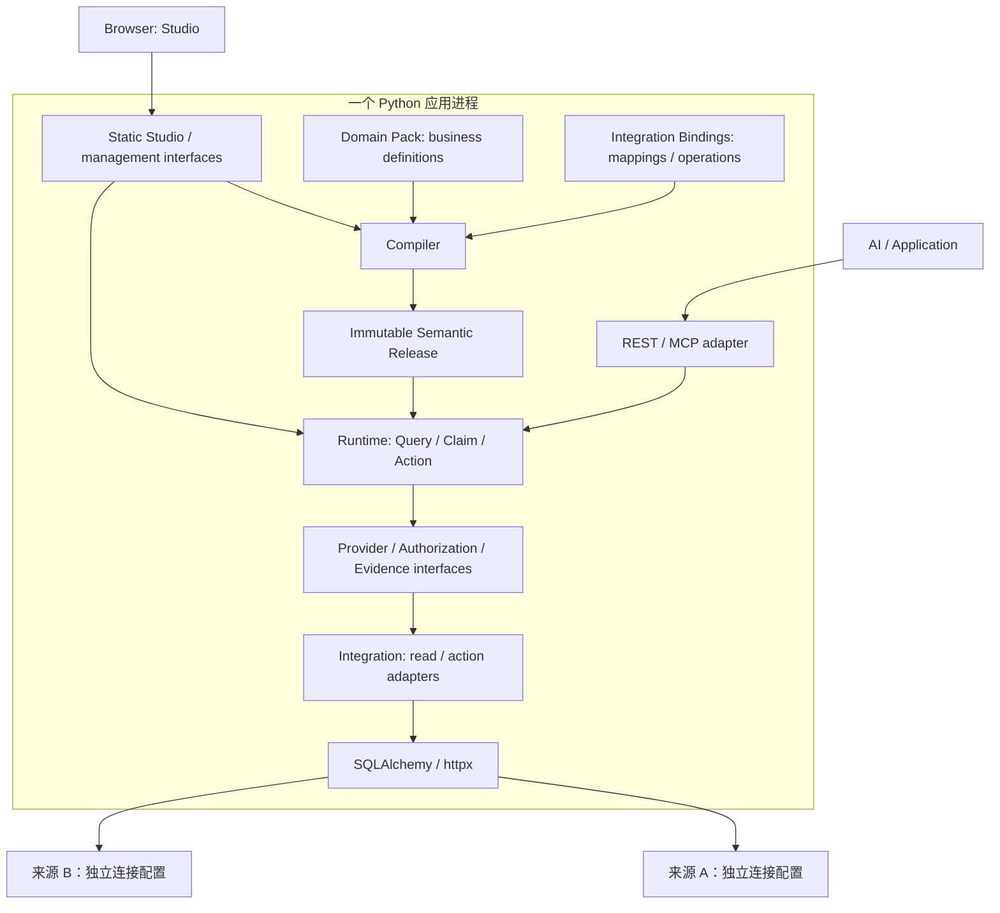

# SemaLoom Python 架构基线 v0.1

## 目标与适用范围

SemaLoom 是通用企业业务语义层，采用 Python 与 Apache-2.0。通过经审核的业务模型，让 AI 或应用用稳定的业务标识查询事实、评估命题、计划并执行受控操作。确定性是指相同语义发布版本、执行 profile、环境绑定、身份范围、来源输入与请求产生相同语义计划和结果；时间戳、trace ID 不要求相同，变化中的远程系统也不会永远返回相同数据。

面向各类企业业务，行业知识由领域包表达，来源差异由独立接入层适配。税务与采购用于验证通用性。首版支持能力由接口 profile 与验收案例明确界定。

## 架构决策

采用一个 Python distribution、一个应用进程部署。Compiler、Runtime、接入 adapter 和后台恢复任务在进程内装配；模块独立不要求分开部署。核心拥有语义类型、编译、规划及执行；来源数据通过 adapter 读取，业务定义由领域包提供，物理绑定由独立接入声明提供。请求固定不可变发布版本；授权与证据覆盖完整执行链路。

关键理由见 [ADR-0001](adr/0001-runtime-and-domain-packs.md)、[ADR-0002](adr/0002-observation-truth-and-errors.md)、[ADR-0003](adr/0003-immutable-release-and-evidence.md)、[ADR-0004](adr/0004-action-delivery-and-approval.md)、[ADR-0005](adr/0005-python-and-dependency-ownership.md)、[ADR-0006](adr/0006-independent-integration-layer.md)、[ADR-0007](adr/0007-in-process-source-composition.md)、[ADR-0008](adr/0008-studio-and-metadata.md)。

## 内化什么，复用什么

内化是掌握领域契约、算法决策与替换 seam，不等于删除依赖或把所有依赖复制进仓库。我们拥有语义解析后的模型、Mapping 语义检查、依赖展开、合法路径选择、Fact 归一化、三值判断、政策选择、Action 协议和 Evidence 关系；这些构成产品本身。

复用数据库连接池、HTTP、输入校验、Web 框架、迁移、协议 SDK 和观测基础设施。让它们集中在明确的 adapter 内，用外部行为契约测试替换性；不为每个库套一层透传 wrapper。

上游阻塞时先评估配置、组合或修复；维护 fork 需要具体缺口、来源许可、测试及同步责任。第三方内存模型留在实现内。

## Python 技术选择

| 能力 | 首选 | 取舍与引入条件 |
| --- | --- | --- |
| HTTP / 输入模型 | FastAPI、Pydantic | Pydantic 模型导出 JSON Schema，并加标准校验；领域语义检查由 Compiler 负责 |
| 关系查询 | SQLAlchemy Core + psycopg | 受限关系计划通过单一 SQL 生成链执行 |
| 连接与持久化 | PostgreSQL、SQLAlchemy、Alembic | 来源只读与 metadata/action 写入分角色；ORM 仅在持久化实现需要时使用 |
| API | httpx | 只读 API Provider 与 ActionExecutor 分离；注册服务和受控 OpenAPI profile |
| 工作台 | React、TypeScript、Vite、React Flow | 构建静态资源由同一应用提供；交互与样式见 [DESIGN](DESIGN.md) |
| 依赖 DAG | 标准库 graphlib + 有界邻接表搜索 | 用于拓扑排序、环检测与有限路径规划 |
| 规则 | 小型类型化表达式树、Decimal | 仅字面量、输入引用和允许列表运算；无 Python 代码、任意函数或循环 |
| 权限 | 自有小型 AccessDecision/Scope 契约和固定策略 profile | 首版仅默认拒绝、角色能力和租户/对象范围；不自研通用 ABAC 语言 |
| 监控 / MCP | OpenTelemetry、官方 MCP Python SDK | 按 T06 引入统一协议实现 |

异步 I/O 适合数据库/API 等待，但不能让 CPU 密集的规则/规划无限占用事件循环。在单应用进程内使用有界计算和受控连接池，按实测负载确定预算；async 不等于 CPU 并行。

## 模块与依赖



图表示运行协作；Python import 方向是 `app → adapters → core`，`app → core`，`compiler → core model`；app 将 adapter 的验证/编译能力注入 Compiler。Core 和公共 Compiler 不依赖协议实现、厂商 SDK 或领域包代码。Composition root 在 app 中装配实现；Provider 返回规范化观测，不向 Rule 暴露数据库 Row 或 ORM 实例。

| Module | 拥有的行为与小接口 | 不应泄露给调用方的实现 |
| --- | --- | --- |
| Compiler | `compile(domainPacks, integrationBindings, catalogSnapshot) → bundle/diagnostics` | 声明解析、公共语义检查、调用接入校验接口、序列化 |
| Runtime | `query`、`evaluateClaim`、`planAction`、`executeAction` | 依赖展开、路径选择、限额、缓存、规则执行、状态机 |
| Registry | `load(digest)`、`activate(environment, digest, expectedRevision)` | 持久化、发布审批证据、环境指针并发控制 |
| ReadProvider | `capabilities`、`planFetch`、`fetch` | 方言、认证、分页、物理过滤、来源引用 |
| ActionExecutor | `execute`、`reconcile` | 写入协议、幂等传递、read-after-write 核对 |
| Authorization | `authorize(subject, operation, resources, context) → decision + scope` | 策略计算；决策不等于仅一个布尔值 |
| Evidence | `record`、`explain` | 受控存储、脱敏、保留策略、来源关系 |

这是一张职责表，不要求第一天创建全部接口和子项目。ReadProvider 与 ActionExecutor 必须分开，不能用一个 `execute()` 同时承担读和写。内部 Planner、Policy Resolver、Rule Evaluator 先是 Runtime 内的包；只在测试或真实实现变化需要时设置 seam。

## 接入层独立性

| 变化 | 修改归属 | 保持稳定的接口 |
| --- | --- | --- |
| 新增企业业务 | 领域包、对应接入绑定和 fixture | core 查询、规则、操作接口 |
| 同业务迁移表结构或厂商系统 | Mapping / Action Binding / 环境绑定 | 领域业务定义与 core |
| 新增来源协议或厂商能力 | 接入 adapter、profile 校验和 app 注册 | 公共 Compiler 与 core |
| 通用语义能力扩展 | 独立契约变更、ADR 与兼容性验证 | 禁止以行业特判替代通用设计 |

Core 选择语义合法路径、执行预算和授权约束；接入 adapter 编译物理查询，执行协议并返回规范化观测/操作结果。物理字段和 operation 只存在于受审核接入产物；core 持有其标识与摘要，不解释协议专属结构。依赖关系与验证见 [ADR-0006](adr/0006-independent-integration-layer.md)、[ADR-0007](adr/0007-in-process-source-composition.md)、[ADR-0008](adr/0008-studio-and-metadata.md)。

## 实体建模工作台

Studio 以实体关系图为入口，联动属性/规则检查器和来源追踪；实体可以映射多个数据库及 API。元数据使用 PostgreSQL，图谱从版本化定义投影生成；图布局独立于语义发布。前端通过受控管理接口保存草稿、验证和发起发布，不直接写来源或运行任意查询。布局、组件、前端技术栈和发布流程以 [DESIGN](DESIGN.md) 为准，实施归属 T09。

## 拟采用的仓库布局

T00 已创建 `pyproject.toml`、`uv.lock`、`.python-version`、`src/semaloom/`（含 `app` 组合根、`core`/`compiler` 包根与 import 方向检查）、`tests/` 与 CI。其余目录随对应任务按需创建，不要按本图批量建空接口。

```text
AGENTS.md / CONTEXT.md / README.md
docs/
  PLAN.md / architecture.md / acceptance.md / references.md
  spec/semantic-contract-v0.1.md
  adr/
pyproject.toml / uv.lock / .python-version
frontend/                   # T09 创建，构建后内置于 Python 发行物
semantic-spec/v0.1/          # T01 生成并验证完整契约
examples/{tax,procurement}/
  domain/                   # 业务定义
  integration/              # Mapping / Action Binding
  fixtures/                 # 合成来源与期望结果
src/semaloom/
  core/{model,query,claim,action,security,evidence}/
  compiler/
  adapters/{relational,openapi,postgres}/
  app/
tests/                      # 契约、行为、集成及 import 依赖检查
.agents/                    # ignored，任务状态与私有交接
```

单个 Python distribution，使用 import 依赖检查防止 core 反向依赖 adapter。接入实现随应用一起安装和启动。首版不建立插件市场、自动插件发现或脚本上传执行环境。表内函数签名与目录名是设计起点，执行 agent 可在职责不变时细化调整。

## 读链路

1. Gateway 验证身份，服务端注入 tenant、actor、授权上下文；校验请求结构、体积和查询预算。
2. 固定环境对应的 release digest、环境绑定和执行 profile，按当前权限解析请求中的精确 semantic ID；发现和错误信息同样限权，历史 release 不携带过期访问权。
3. 对 Claim 先解析业务时间对应的 Policy，再展开该 Rule 的实际依赖。请求跨越多个政策版本时显式拒绝或要求拆分。
4. 对依赖逐项授权，确定不可放宽的行范围与字段范围，选出语义兼容的批准 Mapping 和 Link。
5. 编译有节点数、路径长度、行数、调用数及 deadline 上限的 DAG；先过滤语义和安全条件，再比较成本。
6. Provider 在来源端对每个读取表/关联应用身份范围与参数化过滤，返回 typed observations、完整性信息和来源版本。每次远程调用在预算内执行；取消由 adapter 负责远程工作及连接状态清理。
7. 在进程内按声明的 Link 和规范化业务键组合跨来源观测，检查单位、精度、粒度、基数和来源冲突。按同一次请求内的完整语义键复用观测；具体组合行为见 [Provider/Planner 契约](spec/semantic-contract-v0.1.md#7-providerplanner-与缓存)。
8. 对 Rule 必需输入做预检，执行纯规则，组装 Claim 和受控 Evidence。响应区分业务结论与执行诊断。

`intent: taxRiskAnalysis` 不能驱动 core 中的硬编码分支。上层解析为已有 Claim ID 集合；PoC 可以在示例请求中列出这些 ID。可配置的“分析集合”在证明确有复用后再增加，不提前设计任意任务规划语言。

## 跨来源组合

同一 Python 应用通过不同连接配置访问各库，Runtime 负责组合业务结果。例如从订单库读取供应商业务键，再到供应商库按批准 Link 批量点查，按规范化业务键关联返回。每次来源读取独立应用当前授权 scope；缺失、重复与失败保留各自语义。

先下推过滤和字段投影，再做有界的批量键查询及进程内等值关联；总键数、批次数、返回行数和组合内存都有上限。首版开放独立指标组合及有限 Link，不提供任意跨库 SQL。执行与证据由统一 Runtime 管理，见 [ADR-0007](adr/0007-in-process-source-composition.md)、[ADR-0008](adr/0008-studio-and-metadata.md)。

## 写链路

写入复用语义定义、身份和证据，但采用独立 Action 状态机和下游写凭证。计划读取前提、固定执行绑定和精确参数；可信审批后，执行时再次检查当前权限、前提和目标版本，持久化执行意图后才发出写请求。下游将目标条件与写入原子校验，避免前提复查到写入之间的竞态；未决写入提供只读状态查询与恢复核对。详见 [Action 契约](spec/semantic-contract-v0.1.md#9-action)。

## 数据与一致性

- 一个 PostgreSQL 部署可在 PoC 中承载来源 fixture 与 runtime metadata，但使用不同 database/role，避免查询连接获得 metadata 或业务写权限；真实来源接入不要求数据迁移。
- PostgreSQL 直接持久化 Studio 草稿/revision、release、环境索引、审批、执行状态及审计；业务数据库与 API 是独立来源。Query 结果默认仅在请求内存活；Evidence 持久化遵循独立保留模式。
- 同一来源在可支持时使用只读一致性快照；两个来源的观测不默认属于一个全局事务。响应包含观测时间、来源版本和一致性等级。
- 严格跨来源一致性必须有上游共同快照标识或可验证批次关系；无法满足时拒绝严格请求或产生明确诊断。不能用“都是 2024 年”代替一致性证明。
- 业务时间、查询时间、来源记录版本和语义发布版本是四个不同维度。修订历史政策后，旧 release 可保留“当时结论”，新 release 可重新评估历史业务；两者都要明确选择。

## 首版能力闭合

以下关系固定，不留给各任务自行猜测；接口字段仍由任务 owner 细化。

| 能力 | 入口与必要依赖 | 实现归属 |
| --- | --- | --- |
| 对象属性点查、指标点查、有限 Link | 同一个 Query 能力的类型化分支；对象身份和受控 scope | T01 定义，T02 执行 |
| 命题评估、存在性判断、政策比较 | 已发布 `Rule.claim` 定义与独立 evaluation ID；指定业务期间 | T01 定义，T03 执行，T06 发现/描述 |
| 实体工作台 | 实体图谱、属性/规则检查器、数据库/API Mapping、草稿校验发布 | T09；见 [DESIGN](DESIGN.md) |
| 人工数据接入 | 逻辑来源注册、受限元数据、Mapping 验证、环境激活 | T02 检查，T04 控制面，T05 API profile，T09 可视化接入 |
| 历史解释与重算 | release + 执行/环境 profile + 可保留的来源输入；当前授权 | T03、T04，T06 对外 |
| 操作闭环 | 属性/规则前提、计划、审批、原子目标条件、写入、核验、状态查询和崩溃恢复 | T05，T06 传输 |
| 真实身份与隔离 | 校验身份及有效期、当前策略 scope，禁止 demo fallback | T02 定义/验证授权，T06 接入生产身份 |

行为细节以 [契约第 11 节](spec/semantic-contract-v0.1.md#11-发布环境与执行身份) 为准；跨任务验收的阶段职责以 [验收矩阵](acceptance.md) 为准。某个早期任务只做定义，不代表后面的运行保证已经实现。

## 能力范围与扩展

V0.1 提供 PostgreSQL 精确粒度查询、进程内跨来源组合、有限声明式 Link、受限规则与政策选择、固定授权 profile、不可变发布及受控 API 读取/草稿操作。T06 提供 REST/MCP，T07 验证两个领域复用同一运行时；T09 提供内置实体工作台。

第二领域最小案例从 T01–T03 开始：不同业务身份与适用范围必须使用相同编译器、查询和规则接口。领域包以本地声明及精确依赖组合，不承担动态代码执行；冲突拒绝，不按文件加载顺序覆盖。包组合与兼容要求见 [契约第 1 节](spec/semantic-contract-v0.1.md#1-标识类型与发布)。

新方言、超出受限组合的查询能力、标准互操作、复杂策略及工作流由可验收的实际用例触发，另行评估实现与维护成本；当前不预选技术栈。ReadProvider/ActionExecutor 的协议变化由 adapter 承担，同协议内的业务定义和来源绑定变化分别由领域包与接入声明承担。

PoC、开源准备与真实 pilot 分别由 [PLAN](PLAN.md) 的 gate 验收；运行能力及容量由实现证据确认。
