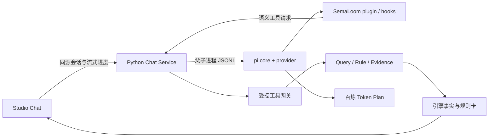

# 内置业务问答与 pi Harness

当前可从 Studio 左侧“问答”直接使用百炼模型，查看分析进度、取消请求、继续对话及展开引擎证据。Python 仍拥有业务语义，pi 负责模型调用和工具循环。开启 Chat 不需要另启 Node HTTP 服务；关闭 Chat 时原业务层仍可独立运行。

## 选型与复用

2026-09-14 检查官方仓库、npm 元数据和 provider 实际模型列表。GitHub star 是当日参考数据，不当作质量保证；版本在 lockfile 中固定。

| 项目 | 当日 stars | 选择 |
| --- | ---: | --- |
| [官方 pi](https://github.com/earendil-works/pi) | 104,874 | 使用 `pi-agent-core`、`pi-ai` 0.85.1；原 badlogic/pi-mono 已重定向到此处 |
| [pi-mcp-adapter](https://github.com/nicobailon/pi-mcp-adapter) | 1,462 | 已调研；面向 coding-agent 的 MCP 扩展，当前内置工具桥接不需要其动态 MCP 与 CLI 层 |
| [官方 MCP TypeScript SDK](https://github.com/modelcontextprotocol/typescript-sdk) | 13,389 | 留给外部协议接入；本轮不重复实现 MCP，也不把本地 IPC 称为 MCP |
| [assistant-ui](https://github.com/assistant-ui/assistant-ui) | 12,139 | 已比较；当前保留 Studio React 与样式，避免同时引入另一套对话 runtime |
| [react-markdown](https://github.com/remarkjs/react-markdown) | 见仓库实时数据 | 使用 10.1.0 渲染 Markdown，未启用 raw HTML，禁用远程图片自动加载 |

pi 官方 core 已提供 `beforeToolCall`、`afterToolCall`、`shouldStopAfterTurn`、工具参数校验、事件流与取消；复用这些机制，未另写 Agent loop。SemaLoom 的插件是小型组合模块 `harness/semantic-plugin.mjs`，不是另一份通用插件加载器，也不自动安装不可信扩展。agent-core 没有网页选择题插件；coding-agent 的 `ctx.ui.select` 不适配当前 headless Node，Studio 用自己的点选卡片（含「其他」输入）。[官方 core 文档](https://github.com/earendil-works/pi/tree/main/packages/agent)

内置场景选择直接调用业务服务：无需 HTTP 回环凭证或 MCP 协议转换。外部 host 可用既有五个 HTTP 工具，或通过 `/mcp/` 的官方 Streamable HTTP transport 使用查询、规则和解释工具；二者复用同一业务网关。没有给模型安装 bash、读文件、SQL、任意网络或代码执行工具。

## 运行分工



聊天扩展可选，pi 子进程由 Python 启停，最多同时 4 个回合运行；没有额外监听端口。它拿到模型凭证、业务目录和已授权的语义结果，拿不到数据库连接和 Studio cookie。生产 JWT 校验属于应用传输边界；Chat 不另建身份实现，也不因此声称外部 IAM 撤销集成完成。

每个会话绑定租户、主体和语义 digest。历史存在原 metadata PostgreSQL，刷新可继续；当前页面标签只在 sessionStorage 保存会话 ID，不保存密钥或完整业务结果。新建对话不会删除旧记录，生产保留策略仍需单独配置。

## 确定性约束

1. **调用前**：pi 校验工具 JSON Schema；hook 限制工具集合和次数；Python 再做 typed request 校验和当前身份检查。对象身份必须先通过本轮 `find_objects` 解析，不能猜一个 ID 直接查询。
2. **执行中**：调用同一 Query/Rule 引擎。每个回合固定 release；发现环境版本变化或会话失效时停止返回结果。期间、口径、完整粒度、基数、缺失/错误的语义沿用业务层。
3. **规则 hook**：查询涉及的一组指标若覆盖某个已定义 numeric Claim 的全部输入（含 `derivedFrom` 依赖），网关自动调用现有规则引擎并附 `checks`。最多 4 个自动检查/查询，更多则要求缩小查询。Policy 不适用会明确返回未完成原因，不当作通过。混合属性规则或未覆盖输入仍需显式 `evaluate_claim`，不承诺自动执行所有规则。
4. **结果返回后**：pi hook 检查返回 digest。`present_answer` 必须引用本轮服务器生成的 evidenceId；模型不能提交事实卡的金额或 truth。最终卡片来自服务器保留的结果，保留单位、状态、规则、源活动。
5. **停止**：每次提交最多 12 个模型回合、20 次工具调用、180 秒；对话最多 12 次用户提交，历史与结果大小有界。断线/取消会终止自己的 Node 子进程。未完成证据提交时显示错误，未核验的模型草稿不直接当最终答案。

这里的确定性保证针对工具输入、执行和事实卡，不代表能用代码证明任意自然语言解释的每一句都正确。页面明确标注“AI 解读”；企业分析应核对旁边的引擎证据。源数据 unreviewed、样本非唯一、缺失或抽取错误必须保留；数字相等不等于审计认可。

## 本地启用

源码目录安装一次：

```sh
corepack pnpm --dir harness install --frozen-lockfile --ignore-scripts
corepack pnpm --dir frontend install --frozen-lockfile
corepack pnpm --dir frontend build
```

服务端配置 JSON 文件，建议权限 0600，放项目忽略目录。以下只是结构示例，不是真实凭证：

```json
{
  "apiKey": "YOUR_TOKEN_PLAN_KEY",
  "baseUrl": "https://token-plan.cn-beijing.maas.aliyuncs.com/compatible-mode/v1",
  "model": "qwen3.7-plus"
}
```

```sh
export SEMALOOM_CHAT_CONFIG="$PWD/.agents/chat-harness/provider.json"
uv run semaloom serve --host 127.0.0.1 --port 8000
```

按上文配置私有 provider 文件与环境变量后，打开 `/studio/?view=chat`，在 local-dev 使用带分析权限的 `studio-admin`。仓库不提供模型凭证；单独 modeler/viewer 不自动获得业务数据读取权限。

provider 端点来自用户配置，调用已验证 `/models` 存在的 `qwen3.7-plus`。保留 Token Plan 的 key/URL 配对，不自动改到按量计费。其 OpenAI-compatible 接入方式与配对要求见 [百炼官方说明](https://help.aliyun.com/zh/model-studio/more-tools)。API key 仅在服务端；不经前端表单传输、不回显、不进入 source control。

### 可选 Jev 决策钩子

设置服务端环境变量 `TYPESAFE_API_KEY` 后，harness 使用官方 `@typesafe-ai/sdk`，把用户问题、Pi 有界上下文摘要、当前本体目录投影、locale 和实时工具 Schema 交给 Jev。一次独立 typed 判断同时覆盖工具 Choice、范围完整性 Noul、本体候选 Choice 和最佳候选匹配 Score；候选只来自当前授权 release，Score 只用于内部阈值，不作为事实准确率或页面置信率。它不接收数据库凭证和物理映射，不产生业务事实，也不能绕过 Python 授权与 typed request 校验。未设置时完全不调用该外部服务。

明确指标、本体范围值、统计方式和已确认查询的省略式追问先走 Python 确定性路径，避免为可判定问题增加外部延迟。语言适配器只输出 role/ID 驱动的类型化约束与分组提示；通用编排没有年度专用字段。`SEMALOOM_JEV_MODE=shadow` 是默认值：其余问题的判断只影响工具排序和模型上下文。Pi worker 只依赖 `SemanticDecisionProvider`，Jev 是当前 adapter；本地或其他模型可实现同一有界候选接口而不改 worker。完成领域及语言评测后可设为 `enforce`，此时 Pi 的 `beforeToolCall` 只对首个高阈值路由分歧做一次可恢复拦截。`SEMALOOM_JEV_MIN_CONFIDENCE` 默认 `0.85`，只在内部使用；页面不展示概率。可用 `TYPESAFE_DEFAULT_MODEL` 固定经过评测的模型，`TYPESAFE_BASE_URL` 仅接受 HTTPS。任何决策 adapter 超时、限流或错误都会回到原 Pi 路径。

浏览器发送用户当前选择的 locale；服务端优先按当前消息的 Unicode 文字特征选择回答语言，纯编号等无法判断语言的输入才回退到该 locale。本体业务名称仍来自发布定义。当前提供 `zh-CN` 与 `en` 的应用文案、补充卡片和确定性结果摘要；通用 system prompt 与工具说明统一使用英文。新增语言只增加资源与评测，不修改领域判断代码。

`harness/provider.mjs` 是模型协议替换位置；默认使用 pi-ai 的 OpenAI-compatible 实现。更换同接口服务需检查兼容参数，不能假定所有厂商接受 Qwen 的 `enable_thinking`。不会为了换模型改业务 Runtime 或 Rule。

wheel 含可选 harness 源码和锁文件，不包含 node_modules。仅开启聊天时需 Node >=22.19，并在 wheel 内 `semaloom/app/chat/harness` 目录运行 pnpm 安装；也可以用 `SEMALOOM_CHAT_WORKER` 指向已安装依赖的独立 harness/worker.mjs。原 Python-only 运行方式保持可用。

## 验证

离线检查无模型 key：`corepack pnpm --dir harness test` 运行原生 pi + faux provider 的 hook 测试；`tests/test_chat.py` 覆盖语义证据、自动规则、猜身份/伪造引用、跨主体隔离、历史冲突、CSRF、版本变化、真实父子进程 IPC 和取消回收。既有合成与真实样本验收仍适用。

已做有界百炼真实调用：问候、规则定义问答、选定样本的指标分析与多轮复核。第一次复杂问题因发现开销触发回合上限，随后加入有界业务目录索引以减少搜索；不隐藏这类可能失败的模型行为。发布前仍应按实际企业问题独立验收，不将几次冒烟等同于所有模型/业务准确率。

该轮 Chat 验收记录只覆盖当时的 harness 与页面范围。随后 A58 JWT 校验和原生 MCP transport 已由普通强制测试闭合，不再以 xfail/skip 记录；这不扩大 Chat 本身的能力，也不代表外部 IAM 撤销、MCP Action 或全项目生产 gate 已完成。

## 可分派的独立验收提示词

以下任务仅测试和报告，不改业务定义、发布状态或共享数据。默认使用离线模型；需要真实百炼调用时每项最多 3 次，不输出密钥或完整业务结果。

**Agent A：业务准确性**

> 验收 SemaLoom 内置 Chat。先读 AGENTS.md、docs/chat-harness.md、docs/ai-analysis.md。围绕一个明确的 ReviewCase 核对申报利润、审计利润、差额和自动 Claim；把事实卡与直接语义查询比较。测试缺失观察、重复版本、未复核来源与 FALSE/UNKNOWN 的区别，检查自然语言是否夸大成审计认可。不要修改定义来让测试通过。报告可复现问题、最小请求和脱敏证据。

**Agent B：harness 与隔离**

> 验收 harness/ 与 src/semaloom/app/chat/。使用隔离测试数据库和离线 provider，检查官方 pi hooks、伪造身份/引用/SQL 输入、版本切换、取消与超时、并发、跨主体历史访问和 worker 回收。严禁对本地真实样本库运行 reset/fixtures。给出每个边界的通过或失败证据，不将既有 JWT/MCP 未完成项混同为本轮 IPC 功能失败。

**Agent C：页面体验**

> 验收 /studio/?view=chat，先读 AGENTS.md、docs/DESIGN.md 和 docs/chat-harness.md。检查首次进入、连续追问、刷新恢复、新建、停止、失败重试、小屏和键盘输入；检查 AI 解读与引擎事实卡区分、Rule 定义不冒充 Claim 结果、外部 Markdown 图片不加载。优先沿用 frontend/tests/chat.spec.ts 的离线接口，不批量消耗模型额度。提交缺陷复现步骤及截图位置。

## 补充信息与动态组件（2026-09-20）

Chat 与引擎共用缺范围属性/缺统计方式的补充卡片；范围属性及类型来自本体，不存在年度专用槽。已移除默认期间、默认合计及置信度评分。模型可通过已有工具的 view/views 提交展示偏好，服务端投影仍拥有事实数据。当前组件支持文字、数值卡、表格、分类柱图、时间折线与已声明关系图，具体约束见 [契约](spec/semantic-contract-v0.1.md#集合统计与浏览器来源表格增补)。不新增模型循环、上下文拼接或第二套计算引擎。自由说明卡片提交后通过原 Chat 入口继续，模型不会获得新的执行权限。

完整合成财务数据与可重复问题见 [财务 demo](../examples/financial-review/fixtures/README.md)。独立真实模型浏览器验证可显式设置 `SEMALOOM_E2E_CHAT_CONFIG`；默认测试仍为 faux provider，不消费模型服务。
