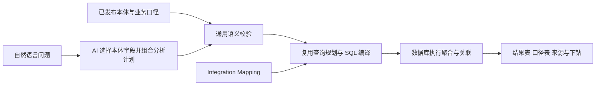

# 从固定分析工具转向通用语义查询

2026-09-14。状态：Q0 已实测并冻结契约，见 [ADR-0011](adr/0011-semantic-query-planner.md)。产品引擎迁移由 Q1 实施，本文保留研究过程。目标是“企业配置本体与来源后，同一套核心承接不同分析问题”，而不是为每一种问法新增 endpoint、prompt 分支或业务计算。

## 判断与推荐

当前瓶颈不在 SQL 的表达力，而在 SemaLoom 只开放了少量点查/年度统计请求。推荐把后续主线改为**本体约束下的通用分析计划，由现成查询引擎编译并下推 SQL**。

优先验证 Wren 的 Python 内嵌规划能力，借鉴 Cube/MetricFlow 的计量语义；保留 SemaLoom 的本体编辑、不可变版本、Rule、来源绑定、Chat 和证据展示。不直接搬入整套 BI 产品，也不默认自研关系优化器。Q0 已嵌入运行 `wrenai` 0.14.0：分组聚合可规划，但输出无参数、strict_mode 未挡住物理表、关系 JOIN 未注入、无主体/总体作用域，故主实现改为 SQLAlchemy Core + SQLGlot allowlist。不把看过 README 当作适配通过。

## 本地代码为什么仍不够通用

| 当前事实 | 影响 |
|---|---|
| 早期集合路径先搜索最多 50 个对象再逐对象点查（已删除） | 聚合未下推；成员数限制成了分析能力限制 |
| [核心定义](../src/semaloom/core/model.py) 的 PopulationSpec 固定单位属性和整数年度；Metric 的 aggregation 只有 NONE/SUM/MAX/MIN | 缺少统一维度、时间分组和可加性表达，不能自然描述季度/月度/多维分析 |
| [来源接口](../src/semaloom/core/provider.py) 主要是 fetch_metric/fetch_object | 不能接收集合执行计划，SQL adapter 的能力未充分暴露给语义层 |
| [Chat 意图检查](../src/semaloom/app/chat/intent.py) 用有限中英表达约束几种操作 | 有助于拦截已知错误，无法穷举自然语言，更不应成为业务语义引擎 |

此前修复解决的是错误答案与参数联通，不是完成了可自由组合的查询架构。这两点应分开判断。

## 开源项目的实际做法

| 项目 | 经官方资料核实的机制 | 对我们的价值与限制 |
|---|---|---|
| Wren | MDL 描述模型、关系与计算字段；规划层把针对模型的 SQL 展开并转成目标 SQL；SDK 可嵌入 Python | 最接近“本体后自由分析”；优先试其编译规划层，不能假定自动符合我们的粒度、Decimal 与证据语义 |
| Cube | 通用请求组合 measures、dimensions、filters、timeDimensions、order；关系与主键指导查询生成及重复计数处理 | 借鉴查询接口和计量保护。是否引入整套运行服务与现有单体约束有关，不能只因功能多直接替换 |
| MetricFlow | 以语义模型和 metric 请求生成 SQL，围绕 entity/grain 规划关联与聚合 | 借鉴分粒度聚合、指标组合；直接嵌入的 dbt 依赖与接口成本另评估 |
| SQLGlot / Ibis | 分别提供 SQL AST/方言处理、可组合分析表达式及后端能力 | 是可复用底座，不会自行知道“收入”、统计单位或业务缺失政策，不能当成现成的企业语义层 |

Wren 当前的 [架构](https://docs.getwren.ai/oss/reference/architecture)、[Python SDK](https://github.com/Canner/WrenAI/blob/main/core/wren/README.md) 与 [engine.py](https://github.com/Canner/WrenAI/blob/main/core/wren/src/wren/engine.py) 支持上述判断。旧 `Canner/wren-engine` 已归档并合入 WrenAI，不能再按旧版服务拓扑选型。[旧仓库迁移说明](https://github.com/Canner/wren-engine)

Cube 的 [查询格式](https://docs.cube.dev/reference/core-data-apis/rest-api/query-format) 区分聚合前维度筛选与聚合后指标筛选；[Joins](https://docs.cube.dev/reference/data-modeling/joins) 使用关系类型和主键处理关联造成的重复计数，并提示多路径需要显式建模以获得稳定路径。其 [Measures](https://docs.cube.dev/reference/data-modeling/measures) 已提供常见聚合/滚动窗口表达。

MetricFlow、SQLGlot、Ibis 的源码、依赖及复用边界详见 [独立引擎研究](research-query-engines.md)。本次核查 WrenAI `main` 的 SDK 元数据为 0.14.0、Beta，不能等同于选定了稳定发布版本；core/SDK 为 Apache-2.0，仍应以最终锁定包的清单为准。[包元数据](https://github.com/Canner/WrenAI/blob/main/core/wren/pyproject.toml)、[仓库许可范围](https://github.com/Canner/WrenAI/blob/main/LICENSE)

## 推荐的运行方式

对外保留小型、可组合的语义接口：探索定义、准备/解释计划、执行计划、获取证据。查询内部描述“选哪些业务字段、过滤、按哪些维度/时间分组、聚合、组合计算、排序/窗口”，不再按“均值问答”“企业占优问答”分别造业务工具。

现有 Agent 接口不接受 SQL 的约束可以保留：AI 提交结构化语义计划，受信编译模块生成引用业务模型的 SQL，再交给 Wren 规划。如果实验表明 Wren 的 semantic SQL 入口明显更合适，可另提出**只允许已发布逻辑模型的 SQL**接口；这属于已有不变量的变更，需替代 ADR 和完整验证，不能偷偷把任意物理 SQL 接入旧工具。

只保留一个规范本体。引擎需要的 MDL 从 release 自动投影生成，不要求企业维护 SemaLoom、Wren 两份定义；引擎 AST/MDL 类型留在接入实现内。连接与执行是否继续使用现有 SQLAlchemy，取决于编译结果的参数化及方言兼容实验，不能先假定 `dry_plan` 输出可无损直接接上。

## 本体需要表达什么

| 一次配置的业务含义 | 通用核心据此决定 |
|---|---|
| 对象业务键、观测粒度、合法关系路径与基数 | 如何关联、哪些操作会把一条业务事实重复计算 |
| 业务维度与时间属性，财年/自然年口径 | 行业/地区分组，年/季/月筛选与比较 |
| 基础测量、默认聚合、允许沿哪些维度相加 | 收入可汇总，时点余额不能随意跨期相加，比例不能直接相加 |
| 来源版本/有效记录选择与缺失含义 | 多份报告如何选择，NULL、未观察到、来源故障如何区分 |
| 指标公式、别名与 Rule | 统一企业定义，歧义澄清，复用确定性判断 |

临时分析可以用已发布指标和受支持表达式组合，不必提前配置每一种“按地区平均、按行业平均、同比、占比”。临时计算不自动变为正式指标或已验证业务 Rule。

例如“一家公司两份报告”不是数据库里简单重复的两行：必须由配置决定是多个期间、版本、口径，还是异常重复。不能用 `DISTINCT amount` 粗暴修复，金额相同的不同企业仍然是两条事实。

## SQL 应承担哪些工作

- 同源的筛选、关联、分组、聚合、排序、分页、常用窗口尽量下推。CPU 和全量数据留在数据库；SQL 参数来自受信绑定，业务问法不拼接 SQL 字符串。
- “占总额”组合为主体值/完整集合合计；“比均值高”组合为差值/集合均值；“超过同行”用严格比较计数/同行数。它们可由通用表达式组合，无需三个企业专用实现。
- 比较对象筛选与统计集合筛选是不同作用域；计划先确定总体，再选主体。把企业名直接放在总体 WHERE 中可能把占比算成 100%。
- AVG 会忽略 NULL，不能因此改变现有 reject 口径。计划需要返回 COUNT(*)、COUNT(value)、缺失/有效数量，受同一政策校验；推入 SQL 的公式也须匹配 Decimal、舍入与三值规则。
- 50 条可以成为证据明细的分页大小，不应成为数据库总体计算上限。总体受查询成本、超时与结果量预算约束，不把截断结果冒充总体。
- 多源数据库/API 不自动具备同源 SQL 的能力。首个实现先完成同源 PostgreSQL；原有有界跨来源路径保留，不偷偷全表拉入内存实现“通用”。

## Hooks 的合理职责

Hooks 校验的是类型化分析计划与执行证据：定义/版本、字段类型、单位、粒度、分母作用域、缺失策略、资源预算和结果引用。自然语言歧义由本体定义、值发现和澄清解决，不依赖持续扩充关键词正则。

保留发现 → prepare/explain → execute → present 的短闭环。准备阶段输出用户可读的口径摘要，执行阶段由同一计划产生结果和来源。合法 SQL 只证明语法与数据库执行条件，不证明 AI 正确理解了用户意图；仍需独立意图测试。

结果默认用表展示数值、口径和物理来源，聚合证据包含来源 Mapping、计划/版本、时间与统计数量；大集合按需下钻。没有来源快照时，下钻重查须标明时间变化，不能谎称它是原计算时的完整明细。

## 复用前的最小适配实验

这是后续实施的具体验收入口，不是本轮已通过的项目。

1. 将现有财务模型和一个非财税模型自动投影为引擎模型，核心不得加入领域 ID 分支；模型变更后原分析计划不改 Python 即可复用。
2. 嵌入 Wren 规划层，以现有 PostgreSQL 对照：分组均值、AND/OR 范围筛选、按月、多个指标、分组后筛选、Top N、同比/占比和严格同行比较。未支持算子明确返回能力错误。
3. 独立 SQL/Decimal 覆盖一对多/两个事实集合、重复金额不同业务键、复合身份、时点余额、零分母、缺失及失败、精度溢出。重点验证 DataFusion/Arrow/SQL 对高精度 Decimal 的限制，不降级为 float。
4. 编译前后验证仅引用已发布模型与可信来源；租户约束落到每个基础关系，不通过最后加一条 WHERE 猜测。Wren SDK 的 strict_mode 当前默认 false，嵌入必须显式配置并验证；底层 binding 不等于 SDK policy 的自动替代。[当前配置源码](https://github.com/Canner/WrenAI/blob/main/core/wren/src/wren/config.py)
5. 用至少数千条合成数据验证聚合实际下推、总体完整，结果明细只分页；数据变更时正确标注来源一致性。保留原审计的数值 oracle，新题不能继续为每题添加核心特判。

若这些 gate 通过，以兼容 facade 将旧 analyze_population 请求翻译到同一通用计划，验证等价后删除重复执行路径。若 Wren 只能通过大量补丁适配现有契约，则记录具体失败，再在 MetricFlow 或现有 SQLAlchemy/SQLGlot 的较小实现间作针对性选择，不同时维护三套查询后端。

## 迁移边界

本轮只完成研究与建议，应用、样本库、发布指针和依赖未变。真正实施时需增补 ADR-0007 对“无通用关系计划”的首版限定，保留 Python 单应用、协议中立核心、发布版本与来源证据。公共 SQL 接口若不引入，则无须取消“不接收调用方 SQL”的不变量。
